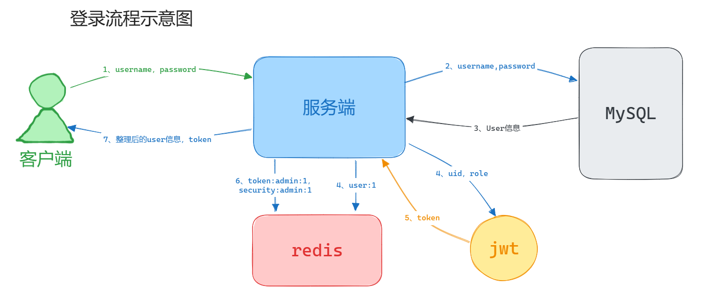
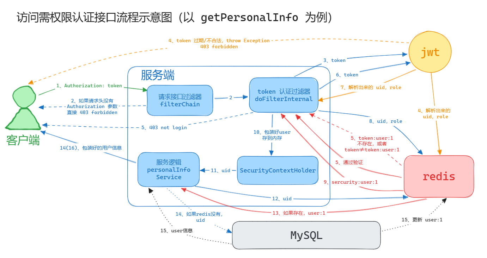

# teriteri-backend
一个基于 springboot + mybatis-plus 搭建的视频网站平台后端

## 开发环境

Java版本：jdk-8

开发框架：springboot-2.7.15、mybatis-plus

技术栈：spring security、redis

数据库：mysql-8.0

## 实现功能

首页推送（目前想法是随机推送，自制模拟大数据推送，有时间再研究开源算法），分区显示，注册登录，用户主页，分片上传，流式播放，发送弹幕，评论点赞，内容搜索，搜索历史，消息系统，关注动态，创作中心以及后台管理员等。

### 注册登录

